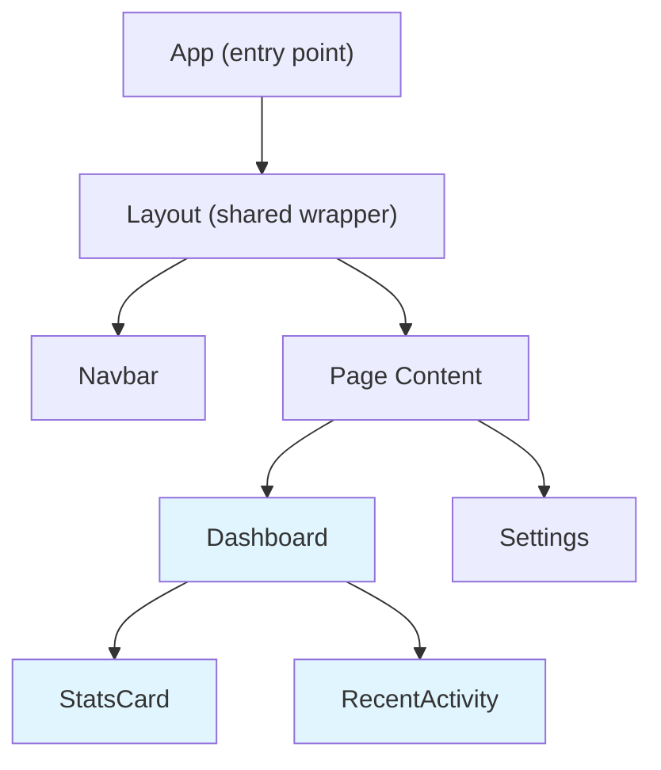
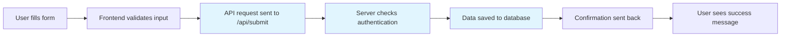
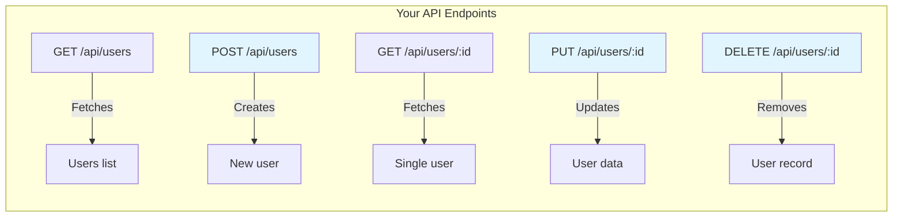
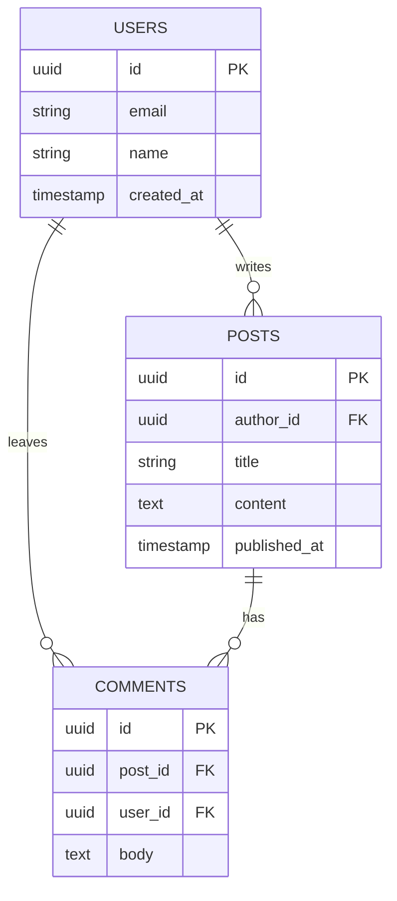
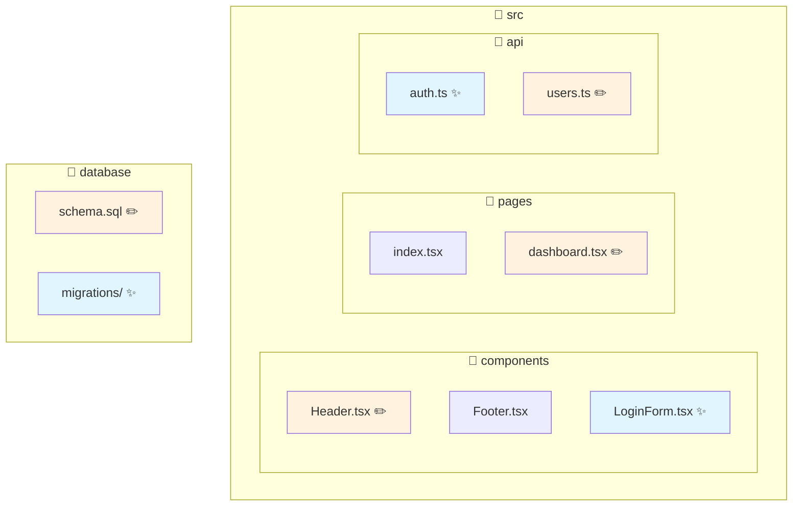
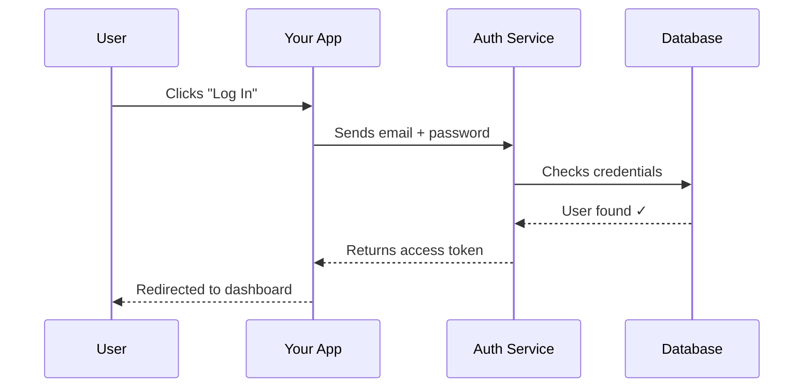
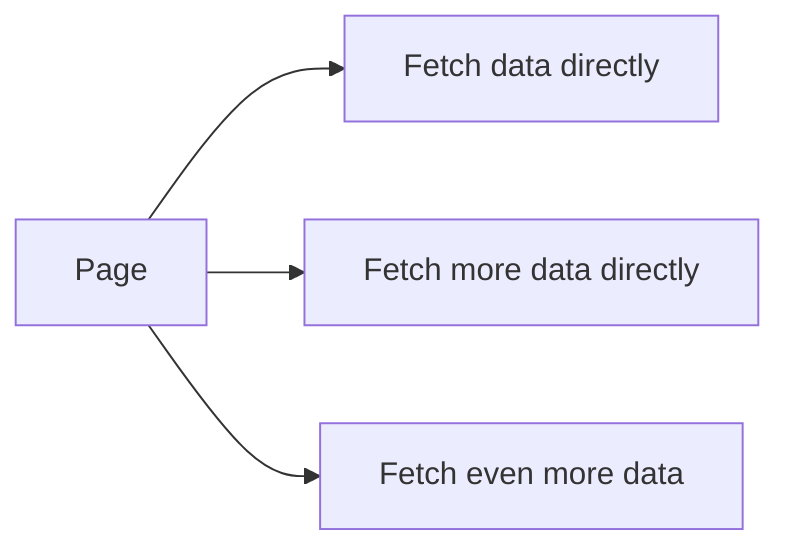
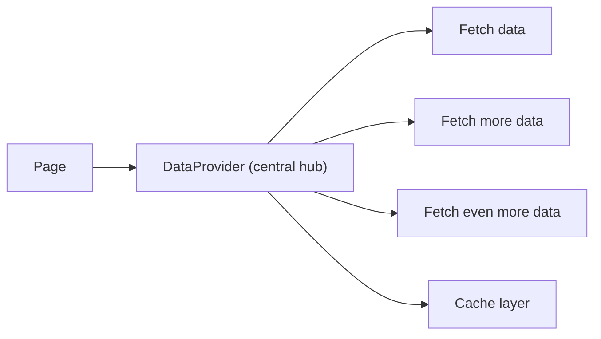
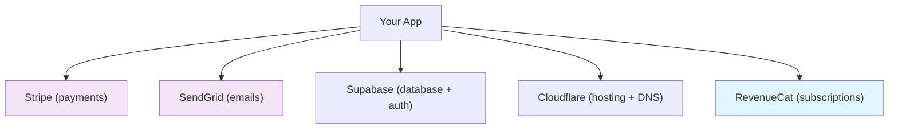

# Mermaid Diagram Patterns

Reference library of Mermaid diagram patterns for common change report scenarios. Pick the pattern that best communicates the change. Combine patterns when needed for large changes.

Always add a plain-English caption below every diagram explaining what the reader is looking at.

---

## 1. Component Relationship Map

Use when: New components were added, or the relationship between parts of the UI changed.



Caption pattern: "This shows how the building blocks of your app are nested. Blue-highlighted boxes are the parts that were added or changed. [Component] sits inside [Parent], which means..."

Note: Use `fill:#e1f5fe` (light blue) to highlight changed/new nodes. Use `fill:#fff3e0` (light orange) for nodes that need attention.

---

## 2. Data Flow Diagram

Use when: The way data moves through the app changed — new API calls, new state management, form submissions, etc.



Caption pattern: "This shows the journey of data when a user [action]. It starts on the left with what the user does, and follows the arrows to show each step. The highlighted steps are the ones that changed."

---

## 3. API Route Map

Use when: New endpoints were created or existing ones were modified.



Caption pattern: "These are the 'doors' into your app that the frontend (or other services) can knock on. Each one does a specific job. The highlighted ones are new or changed."

Jargon helper — always include if this is the first time showing API routes:
- GET = fetch/read data (like looking something up)
- POST = create new data (like filling in a form)
- PUT = update existing data (like editing a profile)
- DELETE = remove data

---

## 4. Database Entity Relationship Diagram

Use when: Database tables were created or modified.



Caption pattern: "Each box represents a table in your database — think of each one as a spreadsheet. The lines between them show relationships: [Users] can have many [Posts], and each [Post] can have many [Comments]. The 'PK' means it's the unique ID for that row, and 'FK' means it references a row in another table."

---

## 5. File Change Map

Use when: Many files were touched and you want to show which areas of the project were affected.



Caption pattern: "This is a map of your project's file structure. ✨ = brand new file, ✏️ = modified file. Blue files are new, orange files were edited. Untouched files are shown for context."

---

## 6. Authentication / User Flow

Use when: Auth changes, user session handling, login/signup flows.



Caption pattern: "This shows what happens step by step when a user [logs in / signs up / etc]. Read it top to bottom — each arrow is a message being sent between different parts of your system."

---

## 7. Before/After Comparison

Use when: A refactor or fix changed the architecture, and showing the contrast helps understanding.

Use two separate diagrams side by side with headers:

```markdown
### Before



### After


```

Caption pattern: "On the left/top is how it worked before — [problem description]. On the right/bottom is the new approach — [benefit description]."

---

## 8. External Services Map

Use when: The app integrates with third-party APIs, payment providers, email services, etc.



Caption pattern: "These are the external services your app talks to. Purple boxes are existing connections, blue boxes are new ones added in this change. Each service handles a specific job so your app doesn't have to build everything from scratch."

---

## Colour key (use consistently)

| Colour | Hex | Meaning |
|--------|-----|---------|
| Light blue | `#e1f5fe` | New / added |
| Light orange | `#fff3e0` | Modified / changed |
| Light purple | `#f3e5f5` | External service |
| Light green | `#e8f5e9` | Working correctly / verified |
| Light red | `#ffebee` | Needs attention / risk |

---

## Tips

- Keep diagrams simple. If a diagram has more than 15 nodes, split it into multiple focused diagrams.
- Use subgraphs to group related items — they act like labelled boxes around clusters of nodes.
- Use quoted strings for node labels with spaces or special characters: `A["My Node Label"]`
- Arrows with labels tell a richer story: `A -->|"sends data to"| B`
- When in doubt, use `graph TD` (top-down) for hierarchies and `flowchart LR` (left-right) for processes.
